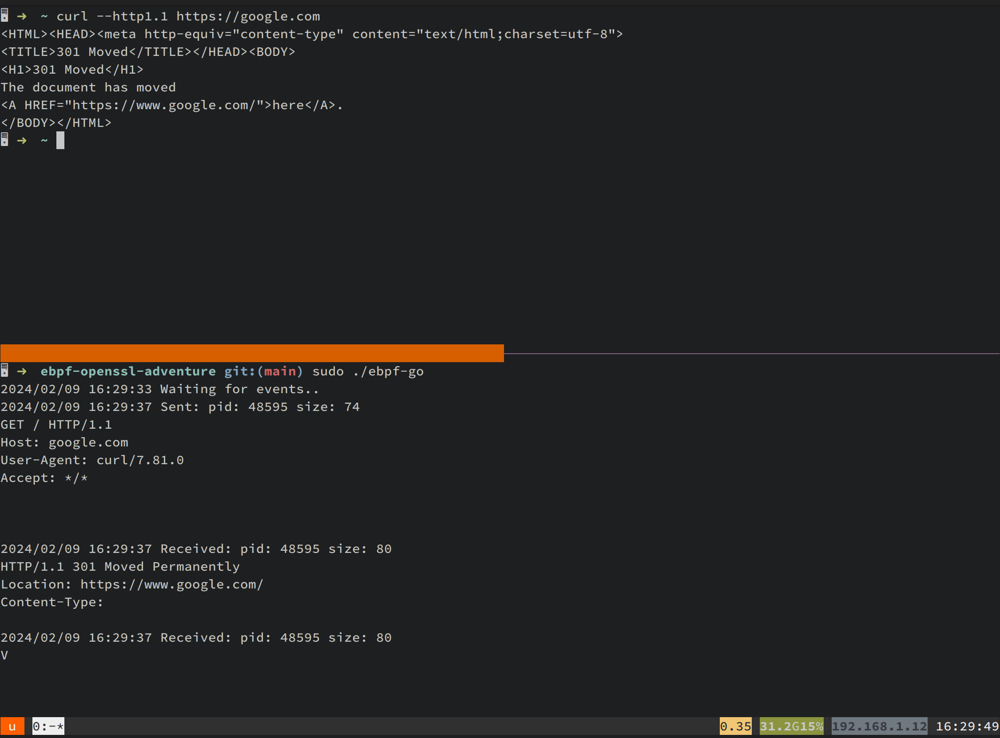

# eBPF User Probes Demo - OpenSSL Interception
This is a simple demo showing how to use eBPF `uprobe`s and `uretprobe`s to grab
data from applications using OpenSSL before it is encrypted, and after it is decrypted.

This lets us see application traffic without having to setup a man-in-the-middle proxy,
and dealing with the associated certificate mess.

You can read more about how this was built [here](https://blog.scottgerring.com/p/99491f63-b8dd-49fe-8021-418ffe24e549/).

## Usage
This is Linux only, of course. Once you have an environment setup that can run [ebpf-go](https://ebpf-go.dev), you're good to go!

```bash
go generate
go build
sudo ./ebpf-go
```

